# Quick Start

**The following documentation assumes completion of the installation instructions in the primary [README](../README.md).**

As background context, consider the systems model as a chemical compound. Then the pattern subgraph represents a molecular structure, an identifiable and repeated collection of, model elements, atoms and bonds. When repeated and combined with other patterns, the subgraphs bond to create complex and diverse systems. Model elements such as blocks, connectors, and ports act as the atoms forming each molecule, with UML roles serving as the bonds between the atoms. Thus, building model-compounds requires identifying the desired, molecules, patterns and providing the, atoms, model data. Using the pattern subgraph as the recipe, RMT ingests the Excel data, creating an instance of the specified pattern for each row in the Excel file; creating nodes and edges omitted by the user but required by the pattern (see [PATTERNS](../ingrid/src/model_processing/patterns/README.md) for a detailed discussion on the methods RMT uses to create "derived" nodes). RMT creates a set of instructions translating the model molecules into blocks, connectors and ports within MagicDraw. Chaining patterns creates new model elements and bonds between subgraphs, allowing users to create complex models, compounds.


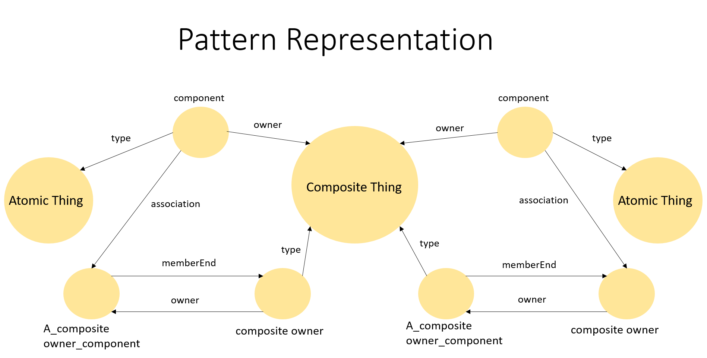


## The Example Model

Ingrid serves as a productivity tool allowing Model Based Systems Engineers to canvas data from stakeholders and incorporate that data into their Cameo Systems Model. Ingrid fulfills these duties by analyzing an Excel file according to specified modeling patterns to create a `JSON` representation of the model. Next, the Player Piano interprets the JSON created by Ingrid through a series of API calls to MagicDraw actualizing the completed MBSE artifact.

For Ingrid, a modeling pattern refers to a `JSON` file located in the [patterns](../ingrid/src/model_processing/patterns) directory that describes a particular UML Metamodel. At this moment, Ingrid has defined patterns for Composition, System Parts, Function Elaboration, Interface Data Flow, and others found [HERE](../ingrid/src/model_processing/patterns). As mentioned, Ingrid uses these UML metamodel `JSON` files to transform the data from the human readable Excel file into a meaningful model representation. When creating an Excel file, it is imperative to know which UML metamodel the data adheres to and to name the columns of the data according to the `keys` in the `Columns to Navigation Map` variable of each pattern `JSON`. Ingrid looks for those column names, which serve as a human readable translation of the UML metamodel meaning, and maps the UML metamodel interpretation onto those headers to understand the data present in the Excel file and the remaining columns it must create to fill out the subgraph. A subgraph provides the minimal representation required to model a feature in the model that corresponds to a row in the Excel file.

The Player Piano uses the UML metadata for each model element to call MagicDraw's API translating the graph representation of the model created by Ingrid into a fully functional Cameo model.

The Quick Start covers the create and compare commands available and the common ways System Engineers use them to develop complex models in practice.

## Create the Model

Ingrid's create command ingests an Excel file(s) and generates a `JSON` file(s) with instructions for MagicDraw's API to create the diagram(s) specified by the Excel, adhering to the specified modeling pattern. This example chooses to use the [Composition](../ingrid/src/model_processing/patterns/Composition.json) modeling pattern to create a composition example model.

1. Open an Excel file and for the purposes of this example, save the file as `Composition Example Baseline.xlsx` into this [quickstart](../ingrid-quick-start) directory, the same location as this README.md. The [Composition](../ingrid/src/model_processing/patterns/Composition.json) pattern defines 3 columns within `Columns to Navigation Map`; these columns must exist in the Excel worksheet. These columns are "Component", "Part", and "Position".


**You must name this sheet with the PATTERN you intend to use!**


2. Populate the rows of the Composition sheet in the excel file with the following data and save the file:

| Component                     | Position           | Part                          |
|-------------------------------|--------------------|-------------------------------|
| Spacecraft                    | Pyramid Slot B IMU | Inertial Measurement Unit     |
| Spacecraft                    | PIA                | Propellant Isolation Assembly |
| Spacecraft                    | PCA                | Pressurant Control Assembly   |
| Spacecraft                    | TCA                | Thruster Cluster Assembly     |
| Spacecraft                    | ME                 | Main Engine                   |
| Propellant Isolation Assembly | LV-1               | Latch Valve                   |
| Propellant Isolation Assembly | LV-2               | Latch Valve                   |
| Propellant Isolation Assembly | SV-3               | Solenoid Valve                |
| Propellant Isolation Assembly | SV-4               | Solenoid Valve                |
| Pressurant Control Assembly   | LV-5               | Latch Valve                   |
| Thruster Cluster Assembly     | Thruster-1         | Small Thruster                |
| Thruster Cluster Assembly     | Thruster-2         | Small Thruster                |
| Spacecraft                    | ST-1               | Star Tracker                  |

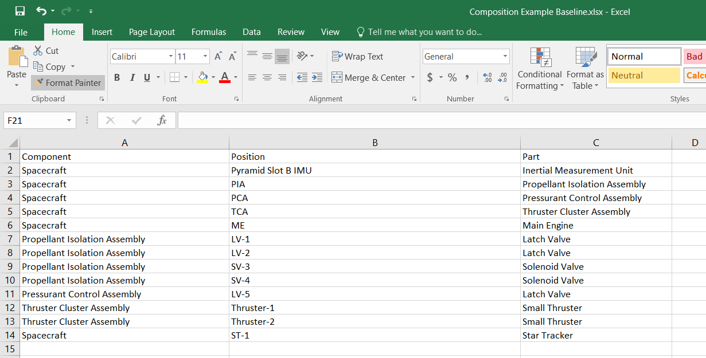

Ingrid uses the data entered, the sheet named after the desired pattern ("Composition") and the columns names based on desired pattern ("Component", "Position", and "Part") to process the create request and generate the create model `JSON`.

3. Navigate to [../rapid-modeling-tools/ingrid](../ingrid) and activate the environment created by the [installation procedure](../README.md). On the command line, enter
```bash
cd ../ingrid-quick-start
model-processing --create --input "Composition Example Baseline.xlsx"
```
[../ingrid/README.md](../ingrid/README.md) contains a detailed explanation of the commands given above, what the flags means and more.

The create command invoked above creates a `JSON` file named "Composition Example Baseline.json" in either the specified output directory (as given here) or the same directory location as the input file when not provided an output directory. This `JSON` file contains the instructions required by the Player Piano to build the Cameo model expressed by the Excel data.

4. Load the model into Cameo, open up Cameo Systems Modeler. Before employing Piano Player, you will need to load the example model into Cameo. In Cameo, select **File > Open Project...** and select `Import Example Base.mdzip` file. Then use the **Tools > Macros > Player Piano** menu item to launch the player piano script. Select `00 Core Model` and press `Ok`. This sets the Core Model as the default landing package.

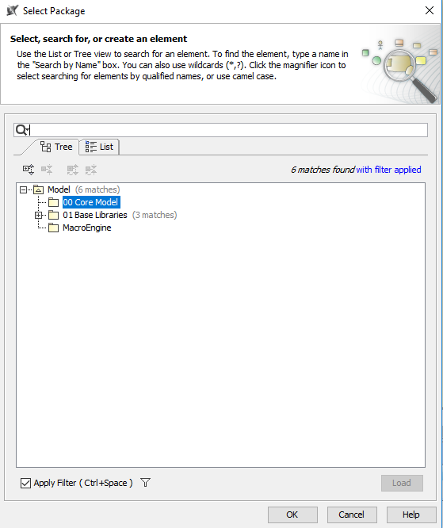

5. Select the `Composition Example Baseline.json` file to be the source of update instructions. Without a specified output directory, `ingrid` places the output JSON in the same directory as the input file.

After the script runs, new modeling elements populate the Package:

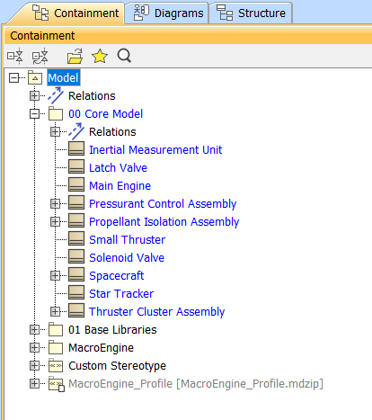

There will be a new `Composition Example Baseline.csv` file with the same name as your `Composition Example Baseline.json` file.
The Player Piano generates the `Composition Example Baseline.csv` file to provide access to the MagicDraw IDs of the newly created model elements. Ingrid expects the MagicDraw ID for any existing model element referenced in Excel files. Moreover, IDs enhance Ingrid's ability to detect changes while reducing duplicate elements.

6. To complete the baseline Excel file, navigate to the directory containing the `Composition Example Baseline.json` and locate the `Composition Example Baseline.csv`. Open `Composition Example Baseline.csv` with Excel. This file contains two columns "Element Name" and "ID". Also open the `Composition Example Baseline.xlsx` Excel file. Copy the contents of the  `Composition Example Baseline.csv` to a new tab in the `Composition Example Baseline.xlsx`  file. Rename this tab to "Composition IDs" (in general name the IDs sheet "*pattern name* IDs") and save the file.


## Update the Model with Compare

The need to rapidly create and maintain models through a deluge of relevant model data prompted the development of RMT. The first part of this quickstart demonstrated how to create a model with data canvassed from Subject Matter Experts, SMEs. The next sections demonstrates model maintenance and pattern layering. Ingrid accomplishes these tasks with the `--compare` command. The `--compare` flag creates a set of `JSON` instructions to update the model represented by the `original` Excel file to agree with the model described by the `changed` file. Ingrid prints unambiguous changes to `JSON`. Ingird prints all detected differences to an Excel file. The Excel file enumerates the complete list of changes Ingrid will make with the `JSON` and any changes that Ingrid was unsure of and hence, left to the user. The two files have the same name and appear in the same output location.

Always include an `IDs` sheet when working with `--compare` to ensure optimal change detection.

### Compare Changes Between Model Versions

Ingrid understands Cameo models through their Excel representation and the accompanying modeling pattern. Ingrid will detect the differences between the original, termed baseline, and a new file, the update.

7. Create a duplicate of the `Composition Example Original.xlsx` and name it `Composition Example Updated.xlsx`. At this point, the duplicate Excel file represents a file sent to a SME or the customer to canvas new data as the project matures. Open `Composition Example Updated.xlsx` and create a new tab named `Renames`.


Suppose the SME interacting with this spreadsheet decided that `Spacecraft` would be more aptly named `Space Ship` and `SV-0` instead of `SV-3`.

8. Switch to the Renames tab and populate the `New Names` columns with `Space Ship` and the `Old Names` column with `Spacecraft`. Underneath, in the `Old Names` column put `SV-3` and `SV-0` in the `New Names`.

| New Names | Old Names |
|-|-|
| Space Ship | Spacecraft |
| SV-0 | SV-3|

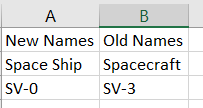

9. Switch back to the pattern tab, `Composition`, and change all occurrences of `Spacecraft` to `Space Ship` (highlighted in yellow) and create a new instance of the pattern graph with the `Escape Pod` component (highlighted in blue).

| Component | Position | Part |
|-|-|-|
| Space Ship | Pyramid Slot B IMU | Inertial Measurement Unit |
| Space Ship | PIA | Propellant Isolation Assembly |
| Space Ship | PCA | Pressurant Control Assembly |
| Space Ship | TCA | Thruster Cluster Assembly |
| Space Ship | ME | Main Engine |
| Propellant Isolation Assembly | LV-1 | Latch Valve |
| Propellant Isolation Assembly | LV-2 | Latch Valve |
| Propellant Isolation Assembly | SV-0 | Solenoid Valve |
| Propellant Isolation Assembly | SV-4 | Solenoid Valve |
| Pressurant Control Assembly | LV-5 | Latch Valve |
| Thruster Cluster Assembly | Thruster-1 | Small Thruster |
| Thruster Cluster Assembly | Thruster-2 | Small Thruster |
| Space Ship | ST-1 | Star Tracker |
| Escape Pod | EP | Emergency Protocol |
| Escape Pod | BT-1 | Backup Thruster 1 |
| Escape Pod | RH | Rear Hull |
| Escape Pod | Activation | Main Engine |

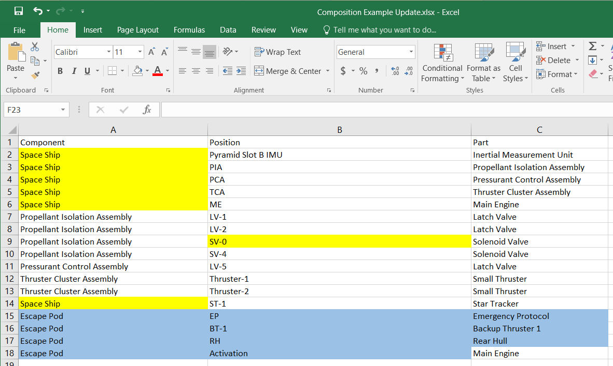

Having created the two data files, Ingrid's `--compare` command computes the differences and provides a `JSON` file for the Player Piano to update the model. To perform the comparison, run the following command.

10. Run the command:
```bash
model-processing --compare --original "Composition Example Baseline.xlsx" --update "Composition Example Updated.xlsx"
```

[../ingrid/README.md](../ingrid/README.md) contains a detailed explanation of the commands given above, what the flags means and more.

Successful execution will create two files, one titled "graph_diff_changes_*date-time*.JSON" and an Excel file named "Model Diffs *date time*.xlsx"

Inspecting the Model Diffs Excel file shows the results of the change detection. The file contains four columns: Edit 1, Edit 2, Unstable Matches Original, and Unstable Matches Change, with columns for Added and Deleted edges included when detected. Edit 1 and Edit 2 contain confidently identified edge changes with Edit 1 containing edges from document passed as the "original" and Edit 2 displays edges from the "update" file. Unstable Matches Original and Change show changes that Ingrid could not determine, with edges from each file in their respective column. Ingrid included all the changes from Edit 1 to Edit 2 in the "graph_diff_changes" JSON but excluded any Unstable Changes. Ingrid assumes the user will resolve the ambiguous changes or provide additional context to the `--update` file (typically including renames) and reprocessing.

The "graph_diff_changes_ *date-time*.JSON" updates the model to reflect the renames and element additions.

11. Open the associated Cameo model and click on the **Tools** tab. Choose **Macros > Player Piano** and select the package to update, it will be the same as the model created at the beginning, navigate to the "graph_diff_changes_ *date-time*.JSON" select and execute the macro. Successful execution of the macro changes element names and adds new elements to the containment tree.


### Pattern Layering

Complex models in MBSE rely on multiple SysML metamodels and patterns; pattern layering with RMT allows modelers to automatically build complex models through a series of `--compare` calls. As an example, the quick start will now layer a [SystemParts](../ingrid/src/model_processing/patterns/SystemParts.json) pattern onto the model developed in the previous sections.

12. Create a new Excel file, saving it to the same directory as the others, and name it `SystemParts Example Baseline.xlsx`. Create a sheet named `SystemParts` and create columns titled `Component`, `Part`, `Context`, `Role`, and `Assoc`. Create a sheet named `SystemParts IDs` populated with IDs from the baseline import and the IDs produced by the `--compare` command.

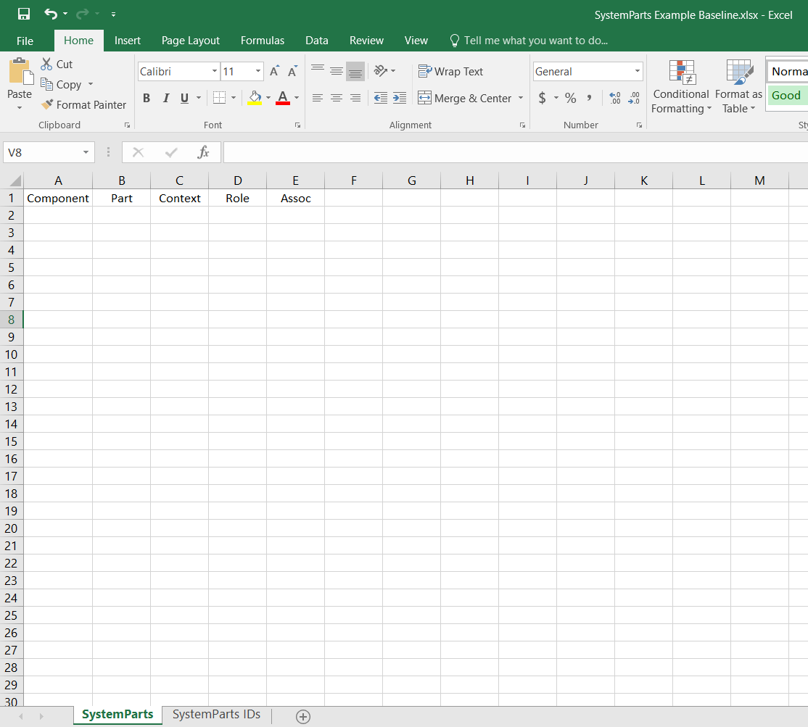

Create a tab titled `SystemParts IDs` and populate with the IDs from the baseline import (located in the `Composition Example Baseline.csv` file produced by Cameo during the initial import) and the IDs produced by the `--compare` command (located in the "graph_diff_changes_0-1 *date-time*.csv" file produced by Cameo during the model update).

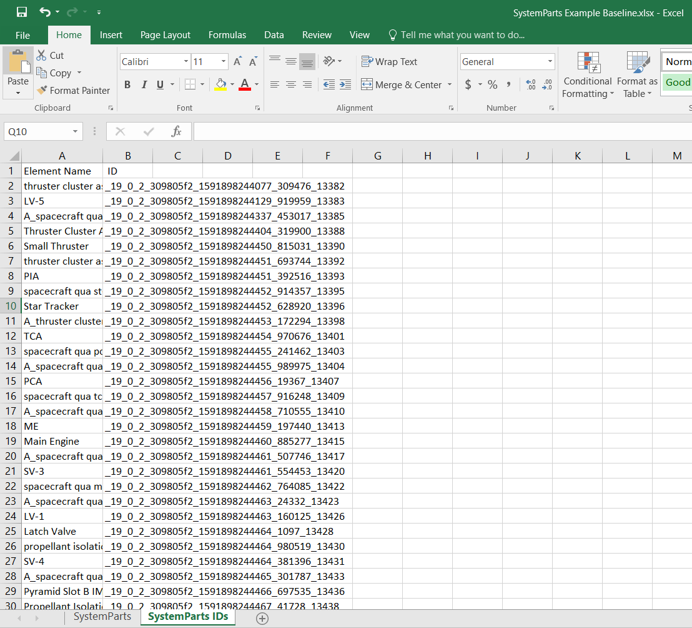

13. Duplicate and rename `SystemParts Example Baseline.xlsx` to `SystemParts Example Update.xlsx`. Open `SystemParts Example Update.xlsx`, switch to the sheet labeled `SysetmParts` and paste the data shown in the table here.


| Component | Part | Context | Role | Assoc |
|-|-|-|-|-|
| new comp | new part | new context | new role | new assoc |
| second comp | second part | second context | second role | second assoc |

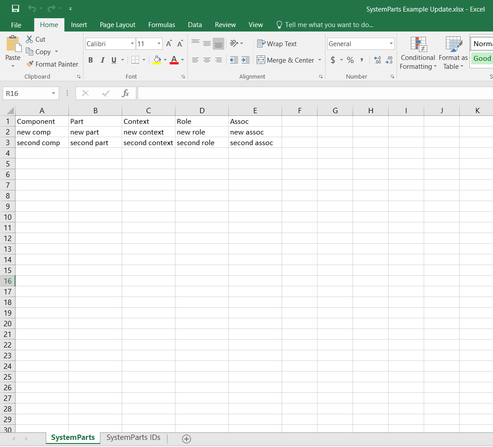


14. On the command line, execute
```bash
model-processing --compare --original "SystemParts Example Baseline.xlsx" --update "SystemParts Example Updated.xlsx"
```

The comparison, between the empty baseline and populated update file, produces add commands for the Player Piano to create new elements to the model adhering to the new pattern.

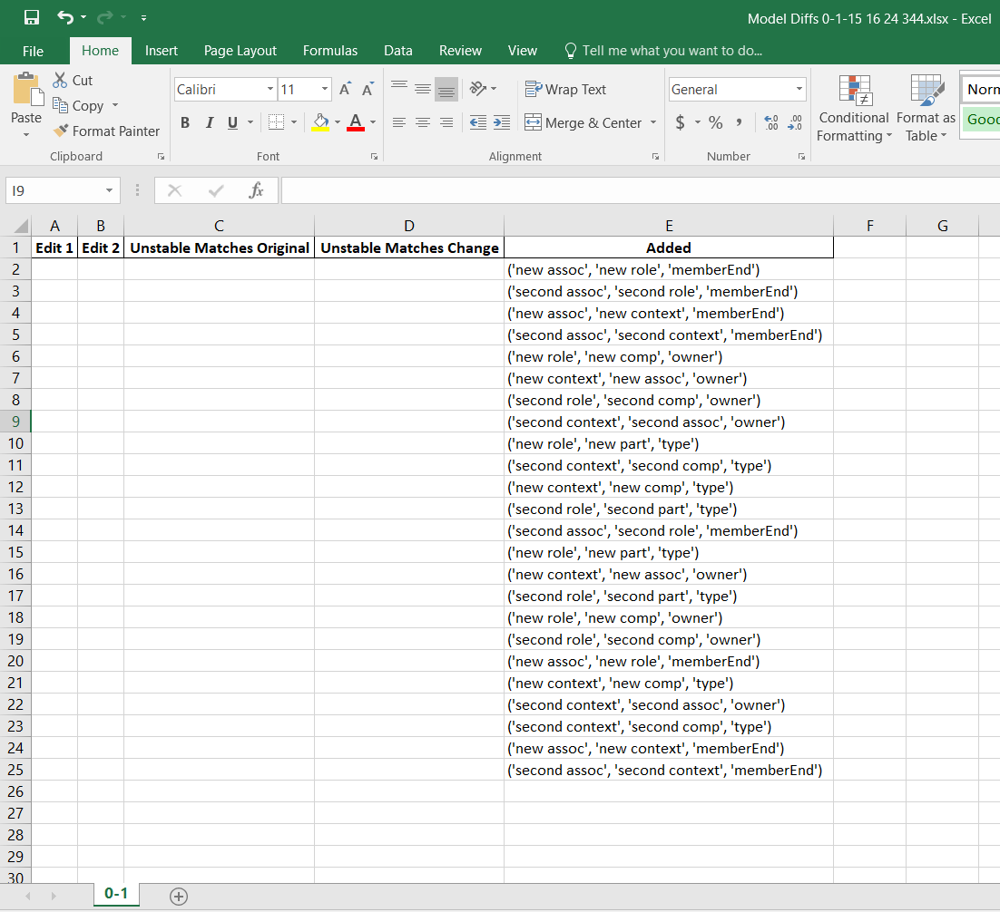

15. Import the changes to MagicDraw using the Player Piano macro to realize the model updates.

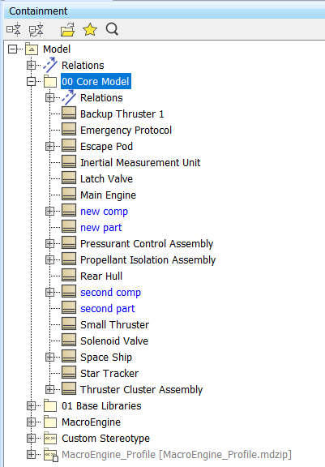
